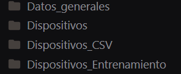
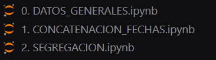
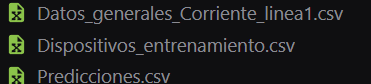
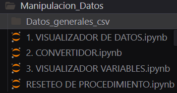

Here’s your text translated into English, keeping the image links exactly as they are:

---

# Data Segregation Project

## Required Folder Structure for Segregation

The following folders are required to carry out the segregation process:

 <!-- Make sure to update the path and file name of the image as needed -->

1. **General Data**: This folder stores the general measurements from the devices.

2. **Devices**: This folder stores the specific measurements from each device, which will be used for training.

3. **Devices CSV**: This folder is intended for concatenating our `.txt` files into `.csv` format. Initially, it will be empty.

4. **Training Devices**: Contains the already processed data to facilitate handling during training. This folder will also start empty.

Codes for segregation:

 <!-- Update this path and name as well -->

In addition, files will be created in the root of the project, as detailed below:

 <!-- Update this path and name as well -->

## Data Reset

To reset the entire system, simply run the following code:

 <!-- Update this path and name as well -->

## Manipulation Folder

This folder is designed to perform specific tasks on the data. It allows you to execute functions such as:

1. **Filter Data by Date Range**: Select and display data within a given time range.
2. **Detailed Visualization**: Provides tools to create graphs and visually represent each variable, thus facilitating data analysis and understanding.

 <!-- Update this path and name as well -->

---

If you want, I can also give it a slightly more **professional and technical style** so it reads more like formal documentation.
